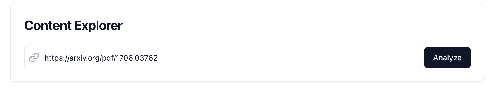
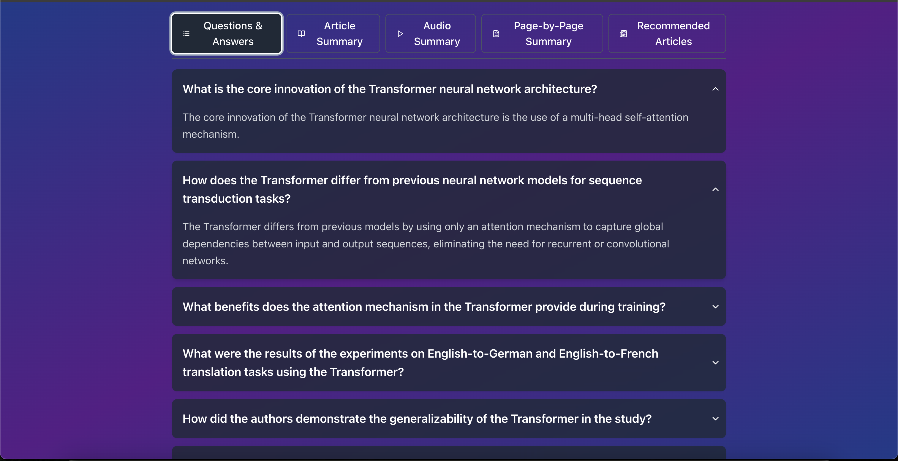
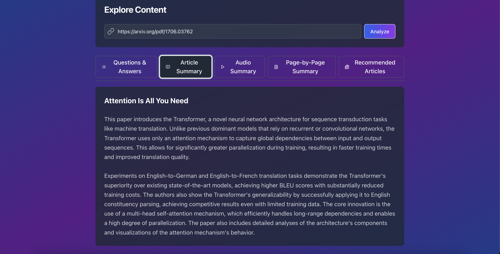
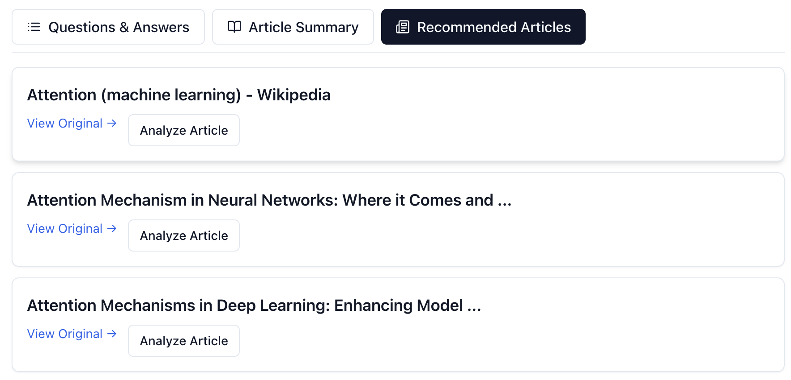

# Q&A Generator: Summarize and Explore Web Content with Ease

Inspired by Google's People Also Ask section, the Q&A Generator is a project to help summarize content from any website into informative questions and answers along with a concise summary of the article. After providing this clarity for the website you choose, the app also generates a list of related articles that you can explore in the same way. This makes it easy to quickly do a deep dive into any topic you want to learn about!

## Features

### Content Analysis Interface

The main interface features a clean URL input field where you can paste any web article or PDF link. The "Analyze" button triggers the content processing pipeline.

### Interactive Q&A Section

Questions are presented in an expandable format, allowing you to focus on specific aspects of the content. Each question can be clicked to reveal a detailed answer, making complex topics more digestible.

### Concise Article Summary

The article summary provides a clear, condensed version of the main content, highlighting key points and main ideas in an easy-to-read format.

### Related Content Discovery

Discover related articles with options to either view the original content or analyze them directly through the Q&A Generator, enabling deeper exploration of the topic.

## Setup Instructions

1. Clone the repository:
```bash
git clone https://github.com/t-gallup/QnA-Generator.git
cd QnA-Generator
```

2. Install Node.js dependencies:
```bash
npm install
```

3. Install Python dependencies:
```bash
pip install -r requirements.txt
```

4. Set up your environment variables:
Create a `.env` file in the root directory with the following:
```bash
OPENAI_API_KEY='your-openai-key'
GOOGLE_API_KEY='your-google-key'
SEARCH_ENGINE_ID='your-search-engine-id'
```

5. Start the FastAPI backend:
```bash
cd backend
uvicorn main:app --reload --port 8000
```

6. In a new terminal, start the React frontend:
```bash
cd frontend/qna-generator
npm start
```

The application will be available at `http://localhost:3000`

## Technology Stack
- Frontend: React with Tailwind CSS
- Backend: FastAPI
- Machine Learning: Transformers (BART), OpenAI GPT
- Additional Features: Google Custom Search API for related content