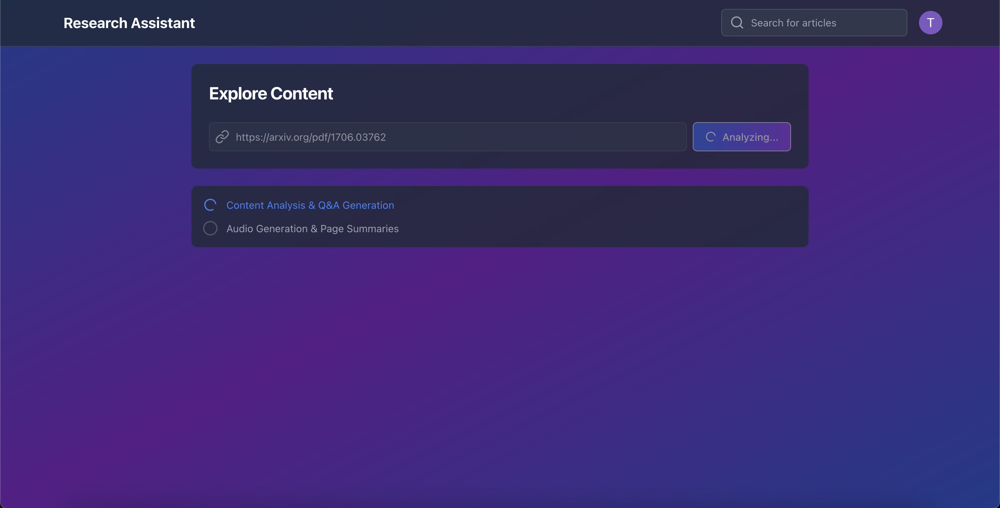
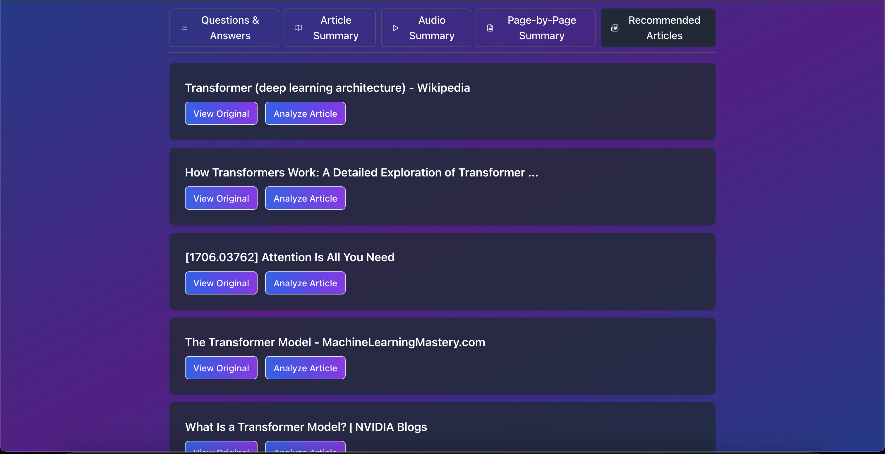

# Research Assistant: Advanced Content Analysis and Exploration Tool

Research Assistant is a powerful application that transforms how you engage with web content. It automatically analyzes articles and PDFs, generating comprehensive Q&A sets, summaries, audio versions, and recommended related content—making research and learning more efficient and accessible.

## Screenshots & Features

### Content Input

*Enter any URL in the clean, intuitive interface. The application supports both web articles and PDF documents, with a simple "Analyze" button to begin the content processing.*

### Questions & Answers

*AI-generated questions and detailed answers provide a guided exploration of the content. The expandable accordion-style interface allows you to focus on specific aspects of the material, revealing comprehensive explanations with a single click.*

### Article Summary

*Get a condensed version of the article that captures key points and main ideas. The summary is presented in a clean, well-formatted layout that makes it easy to grasp the essence of complex materials quickly.*

### Audio Summary

*Listen to high-quality audio narration of your content summary. This feature enables on-the-go learning and accessibility for users who prefer auditory processing or need hands-free options for consuming content.*

### Page-by-Page Summary

*For long documents, dive deeper with detailed summaries of each page. This feature helps navigate larger documents by providing structured insights into the content of specific sections or pages.*

### Recommended Articles

*Discover related content with intelligent recommendations based on your current article. Each recommendation includes options to view the original source or analyze it directly within the application, enabling deeper exploration of topics.*

### Search Results

*Powerful search functionality helps you find relevant content based on your queries. Results are presented in a clean, card-based format with previews and direct links to either view or analyze each result.*

## Key Features

### Comprehensive Content Analysis
- **URL-based Analysis**: Paste any web article or PDF link to instantly analyze its content
- **Smart Question & Answer Generation**: AI-powered generation of relevant questions and detailed answers based on the content
- **Concise Article Summaries**: Get the key points of any article in an easy-to-digest format
- **Audio Narration**: Listen to article summaries with high-quality text-to-speech
- **Page-by-Page Summaries**: For PDF documents, get detailed summaries of each page
- **Related Content Discovery**: Find and analyze related articles to explore topics more deeply

### User-Friendly Interface
- **Clean, Modern Design**: Intuitive dark-themed UI with clear navigation
- **Expandable Q&A Format**: Click on questions to reveal detailed answers
- **Multi-Section Layout**: Easily switch between Q&A, Summary, Audio, and Recommendations
- **Interactive Controls**: Listen to audio summaries or analyze related content with a single click
- **Loading Status Indicators**: Clear visual feedback on processing status

### User Management
- **Firebase Authentication**: Secure user accounts with Google sign-in
- **User Profiles**: Personalized experience with user profile management
- **Usage Dashboard**: Track your content analysis usage
- **Subscription Tiers**: Free, Plus, and Pro tiers with different usage limits

### Advanced Technology
- **PDF Processing**: Advanced extraction and analysis of PDF documents
- **HTML Content Processing**: Smart parsing of web article content
- **Audio Generation**: High-quality TTS using Azure Speech Services
- **AI-Powered Analysis**: Using Google's Gemini and OpenAI's GPT models

## Technical Architecture

### Frontend
- **Framework**: React 18 with TypeScript
- **Styling**: Tailwind CSS with custom color theme
- **Authentication**: Firebase Authentication with Google sign-in
- **State Management**: React Context API for auth and application state
- **UI Components**: 
  - Custom component library with consistent styling
  - Lucide React for iconography
  - Responsive design for all device sizes
- **API Integration**: 
  - Fetch API with authentication headers
  - Error handling with user-friendly messages
- **Performance Optimizations**:
  - Lazy loading of components
  - Debounced input for search
  - Optimistic UI updates

### Backend
- **Framework**: FastAPI (Python 3.9+)
- **Authentication**: 
  - Firebase Admin SDK for token verification
  - Role-based access control
- **Rate Limiting**: 
  - Redis-based implementation
  - Tiered limits based on subscription level
- **Document Processing**: 
  - PyMuPDF for PDF extraction and analysis
  - BeautifulSoup for HTML parsing
  - Intelligent content chunking for large documents
- **Audio Generation**: 
  - Azure Speech Services with high-quality voice synthesis
  - MP3 file generation with custom settings
- **AI Models**:
  - Google Gemini for content summarization
  - OpenAI GPT for Q&A generation
  - Document analysis pipeline with fallback strategies
- **Search & Recommendations**: 
  - Google Custom Search API integration
  - Intelligent filtering of related content
- **Payments**: 
  - Stripe integration for subscription management
  - Webhook handling for subscription events

### Data Management
- **User Data**: 
  - Firestore for user profiles and settings
  - Secure storage of subscription information
- **Content Storage**: 
  - Server-side storage for generated audio files
  - Temporary caching of analysis results
- **Logging**: 
  - Comprehensive error and event logging
  - Performance metrics collection

### Deployment & DevOps
- **Frontend**: 
  - Static hosting with CDN distribution
  - Environment-specific configuration
- **Backend**: 
  - Containerized deployment with Docker
  - Scalable API infrastructure
- **CI/CD**: 
  - Automated testing and deployment pipeline
  - Environment variable management
- **Monitoring**: 
  - Error tracking and performance monitoring
  - Usage analytics

## Setup Instructions

### Prerequisites
- Python 3.9+
- Node.js 14+ and npm
- Redis server (for rate limiting)
- Firebase project with Authentication enabled
- Google API key with Custom Search API enabled
- OpenAI API key
- Azure Speech Services account
- Stripe account (for subscription management)

### Installation

1. Clone the repository:
```bash
git clone https://github.com/t-gallup/Research-Assistant.git
cd Research-Assistant
```

2. Set up the backend:
```bash
cd backend
# Create and activate a virtual environment (recommended)
python -m venv venv
source venv/bin/activate  # On Windows, use: venv\Scripts\activate

# Install dependencies
pip install -r requirements.txt
```

3. Configure backend environment variables:
Create a `.env` file in the backend directory with:
```
# API Keys
OPENAI_API_KEY=your-openai-api-key
AZURE_SPEECH_KEY=your-azure-speech-key
AZURE_REGION=your-azure-region
GOOGLE_API_KEY=your-google-api-key
SEARCH_ENGINE_ID=your-search-engine-id

# Firebase
FIREBASE_SERVICE_ACCOUNT=path-to-your-firebase-service-account-json

# Stripe (Payment Processing)
STRIPE_SECRET_KEY=your-stripe-secret-key
STRIPE_PRO_PRICE_ID=your-stripe-pro-price-id
STRIPE_PLUS_PRICE_ID=your-stripe-plus-price-id
STRIPE_WEBHOOK_SECRET=your-stripe-webhook-secret

# Redis (Rate Limiting)
REDIS_URL=your-redis-url
```

4. Set up the frontend:
```bash
cd frontend
npm install
```

5. Configure frontend environment variables:
Create a `.env` file in the frontend directory with:
```
# Firebase Configuration
REACT_APP_FIREBASE_API_KEY=your-firebase-api-key
REACT_APP_FIREBASE_AUTH_DOMAIN=your-firebase-app.firebaseapp.com
REACT_APP_FIREBASE_PROJECT_ID=your-firebase-project-id
REACT_APP_FIREBASE_STORAGE_BUCKET=your-firebase-app.appspot.com
REACT_APP_FIREBASE_MESSAGING_SENDER_ID=your-firebase-messaging-sender-id
REACT_APP_FIREBASE_APP_ID=your-firebase-app-id
REACT_APP_FIREBASE_MEASUREMENT_ID=your-firebase-measurement-id

# Backend API URL
REACT_APP_API_URL=http://localhost:8000
```

### Running the Application

1. Start Redis server (if running locally):
```bash
redis-server
```

2. Start the backend:
```bash
cd backend
# Activate virtual environment if you created one
source venv/bin/activate  # On Windows, use: venv\Scripts\activate

# Start the FastAPI server
uvicorn main:app --reload --port 8000
```

3. Start the frontend (in a new terminal):
```bash
cd frontend
npm start
```

The application will be available at `http://localhost:3000`

### Docker Deployment (Optional)

1. Build and run the backend container:
```bash
cd backend
docker build -t research-assistant-backend .
docker run -p 8000:8000 --env-file .env research-assistant-backend
```

2. Build and run the frontend container:
```bash
cd frontend
docker build -t research-assistant-frontend .
docker run -p 3000:80 research-assistant-frontend
```
